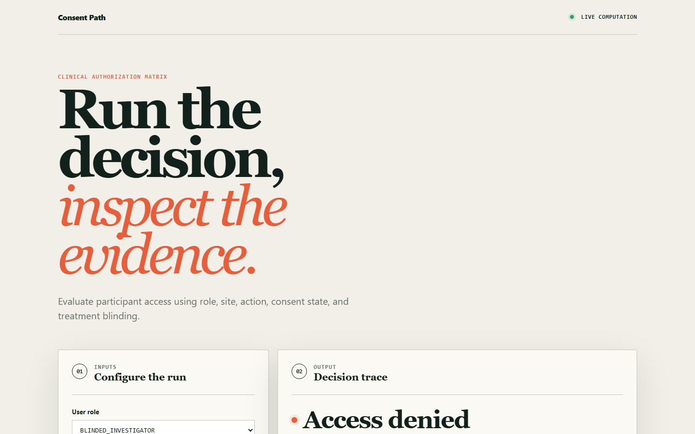
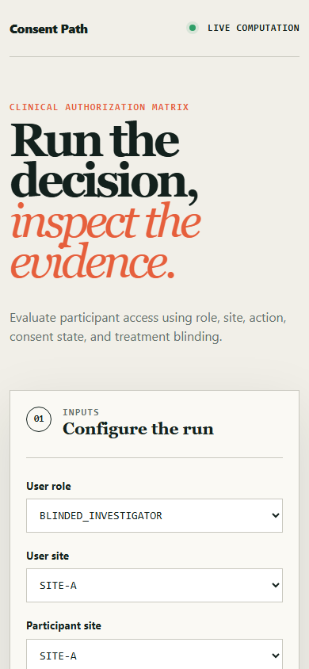

# consentpath

> Clinical trial enrolment where authorisation is a PostgreSQL row-level security policy, defended by a negative-authz test matrix.

## Live deployment

[](https://github.com/SlateGitOrg/consentpath/actions/workflows/ci.yml)

[Open the working Consent Path application](https://slategitorg.github.io/consentpath/)

This deployed application runs the project's decision workflow in the browser. Change the inputs, run the analysis, and inspect the computed metrics and decision trace.

### Desktop



### Mobile



`FLAGSHIP` · **Full Stack Engineering** · Advanced · ~4-5 weeks · Healthcare / clinical research

**Primary language:** TypeScript
**Tags:** `postgres-rls`, `authz`, `fhir`, `privacy`, `sql`, `healthcare`

---

## The problem

In a multi-site clinical trial, a coordinator at Site A must never see Site B's participants, and a blinded investigator must never see arm assignment. Most applications enforce this with a site-ID comparison scattered across request handlers. One forgotten check is a reportable privacy breach, and the forgotten check is always in the endpoint added last, under deadline, by somebody new.

## ⭐ The differentiator

Authorisation lives in **PostgreSQL row-level security policies**, with the application connecting as a low-privilege role that sets session claims - so the API physically cannot read rows it should not. The defence is a **negative-authz test matrix**: every (role x resource x action) pair is asserted to *fail*, which is the suite generic projects never write because writing it means enumerating what should be impossible. Blinding is a column-level grant, not a UI element that hides a field the API already returned.

This is the sentence to lead with when someone asks you to walk through the
project. Everything else in this repo exists to make it true and to prove it.

## Data

Synthetic FHIR-shaped participant records generated with **Synthea** (open source, runs offline), plus a documented generator for site and role assignments that plants known cross-site access attempts. The planted attempts are the recall metric for the authz suite.

> No paid API key is required to run or demo this project. Where a paid
> service would add value it is wired as an optional enhancement behind an
> interface with an offline mock as the default implementation.

## Stack

- TypeScript, Remix
- PostgreSQL with row-level security policies as versioned migrations
- Kysely (typed SQL, no ORM magic obscuring the connection role)
- Synthea for realistic clinical records
- Docker Compose, Vitest

## Core capabilities

- RLS policies for site isolation, blinding, and delegated monitor access - versioned as reviewable migrations
- eConsent capture with versioned consent documents and automatic re-consent on protocol amendment
- Visit scheduling with protocol-window validation (day 14 +/- 3) enforced in the data layer, not the form
- Immutable access log answering 'who saw this participant, when, under which role'
- Data export gated on consent scope, so an export cannot exceed what the participant agreed to

## Repository layout

```
app/                      # Remix application
db/policies/              # RLS policies, one file per concern
db/migrations/
src/authz/                # session claim plumbing, role switching
test/authz-matrix/        # generated negative-authorisation suite
synthea/                  # config + generated cohort
```

## Build plan

1. Stand up Postgres with RLS and two roles. Prove isolation with psql before any TypeScript exists.
2. Generate the authz matrix from a declarative spec - hand-writing 400 cases guarantees gaps.
3. Add the bypass test: raw connection as the app role. If RLS is right, it still fails.
4. Then build eConsent, scheduling, and export.

## Testing strategy

A generated matrix of roughly 400 role/resource/action combinations asserts **denial**. A dedicated bypass test issues raw SQL as the application role and confirms RLS still blocks - proving the guarantee is not a property of the TypeScript. Positive-path tests assert legitimate access is *not* over-restricted, because an authz layer that denies everything also passes a negative suite.

Tests assert **correctness**, not merely that the code runs. A green suite on
this repo is a claim about behaviour under adversarial conditions; treat any
test that would pass against a deliberately broken implementation as a bug in
the test.

## Quality & safety layer

Blinding is enforced by column grant. The access log is append-only. Consent scope is evaluated at export time against the participant's current consent version, not the version captured at enrolment.

## Measurable outcome

> Cross-site data exposure is structurally impossible - 400 negative authorisation assertions pass, including against direct SQL access that bypasses the application entirely.

State it in these terms — business units, not technical ones — in your CV
bullet and in the first thirty seconds of describing the project.

## Interview questions this project answers

- **Why put authorisation in the database rather than the service layer?**
- **How do you test that something is impossible?**
- **What does RLS cost you in query planning, and when would you not use it?**

## What this deliberately is *not*

- Not an EDC product. It models the authorisation problem properly and stops.
- Not HIPAA/GCP certified - it is a demonstration of the control, with a documented gap list.


## Run it now

```bash
npm test        # runs the suite; no install step needed
npm run demo    # the 60-second artefact
```

Requires Node 22.6+ (24 recommended). TypeScript runs natively via
type stripping - there is no build step and no `node_modules`.

## Getting started

```bash
git clone <your-fork-url> consentpath
cd consentpath
docker compose up -d
npm install
npm run db:migrate            # schema + RLS policies
npm run synthea               # generate the cohort (offline)
npm run test:authz            # the 400-case denial matrix
npm run dev
```

Docker is supported but optional — every path above works on a plain
Windows/macOS/Linux laptop without a cloud account.

## Definition of done

- [ ] The differentiator above is implemented, and a test proves it
- [ ] The measurable outcome is produced by a command anyone can run
- [ ] `README` explains the one decision a generic version gets wrong
- [ ] CI runs the full suite on every push and is green on `main`
- [ ] A recruiter can see the headline artefact in under 60 seconds

## Licence

MIT — see [LICENSE](LICENSE).
